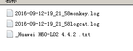

# monkey 压力测试android 
## Monkey的特征
* 测试的对象仅为应用程序包，有一定的局限性。
* Monkey测试使用的事件流数据流是随机的，不能进行自定义。
* 可对MonkeyTest的对象，事件数量，类型，频率等进行设置。
 
## Monkey的基本用法
* 基本语法如下：
	* $ adb shell monkey [options]
	* 如果不指定options，Monkey将以无反馈模式启动，并把事件任意发送到安装在目标环境中的全部包。下面是一个更为典型的命令行示例，它启动指定的应用程序，并向其发送500个伪随机事件：
	* $ adb shell monkey -p your.package.name -v 500
## 分析日志
* 通过Android trace文件分析死锁ANR实例过程
* system/build.prop 日志文件主要记录手机系统信息，如版本，型号，品牌
* adb logcat 导出日志文件

## monkey.ini 配置文件
``` 配置
cmd=adb shell monkey -p com.dgm.user --throttle 500 --ignore-timeouts --ignore-crashes   --monitor-native-crashes -v -v
package_name=com.dgm.user
logdir=d:\android
remote_path=d:\android_server
phone_msg_log=d:\android_temp\phone.txt
sum = 100 -
activity = com.dgm.user.SplashActivity
exceptions=['NullPointer','IllegalState','IllegalArgument','ArrayIndexOutOfBounds','RuntimeException','SecurityException'] 
```
- throttle 每次事件等待500毫秒
- sum 定义随机事件数
- exceptions 异常定义，用于后面扩展
## 结果生成为可视化图片 使用的是matplotlib 


* 当然可以看日志文件

### java文件中是我写的空指针代码
### monkneytest.py入口 

## 2016-9-3  更新日志
* 用三层(DAL,BLL,MODEL)分层的方式重构整个代码

## 2016-9-12 更新日志

* monkey监控app的性能参数，根本就不准确，已经去掉
* 新增monkey做稳定性功能测试，测试报告：




* 可以参考我的[ui自动化测试平台](github.com/284772894/appiumn_auto)


