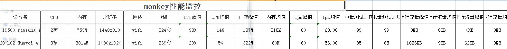
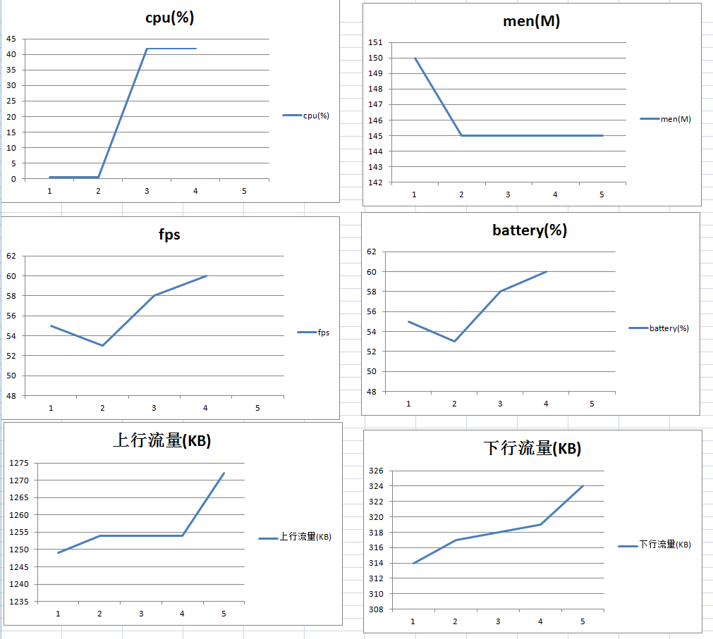
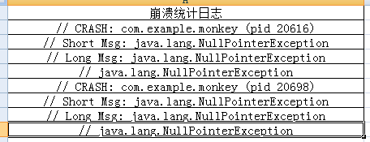

# monkey android test
* python3 
* Statistical performance cpu,men,fps,battery,flow(wifi,gprs)
* Statistics crash info.
* muilt android
 


## monkey.ini setting

``` 

cmd=monkey -p com.jianshu.haruki --throttle 500 --ignore-timeouts --ignore-crashes   --monitor-native-crashes -v -v -v 200 >
package_name=com.jianshu.haruki
activity = com.baiji.jianshu.account.SplashScreenActivity
net = wifi 
```

- throttle Each event waits for 500 milliseconds
- net gprs or wifi








# other
* [Chinese](Chinese.md)


